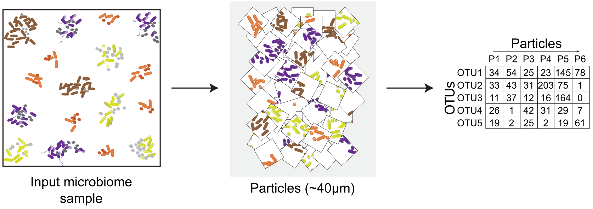
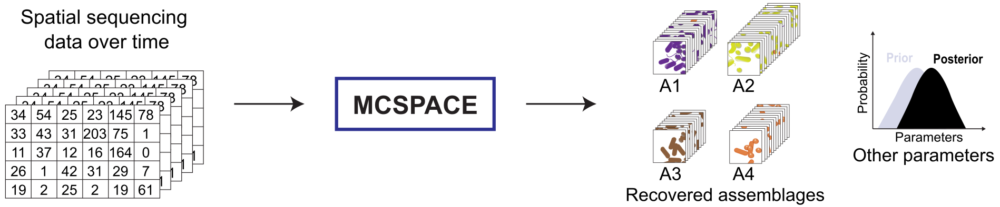
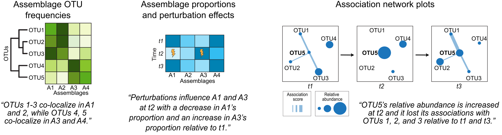

# MCSPACE
Sparse Bayesian mixture model for learning community subtypes and perturbation effects from MaPS-seq experimental data.


### Why use this model?
Over view of MaPS-seq, SAMPL-seq; and this model...




### References
Pre-print

TBA

ICML Computational Biology Workshop paper

***add link

## Installation
First install the MCSPACE package:
```
git clone https://github.com/gerberlab/MCSPACE.git
pip install MCSPACE/.
```

Then install [pytorch](https://pytorch.org/) from pip

## Documentation
TO DO

## Description of inputs and outputs



<!-- <p align="center">

</p> -->


### Generative process

### Visualization capabilities of the software



## Tutorials
We provide tutorials for running the MCSPACE model on a single MaPS-seq data sample [here](https://github.com/gerberlab/MCSPACE/blob/main/mcspace/tutorials/tutorial_single_sample.ipynb), as well as running inference on a perturbation study [here](https://github.com/gerberlab/MCSPACE/blob/main/mcspace/tutorials/tutorial_perturbation_example.ipynb). These show how to use MCSPACE to load data, run the model, and use built in visualization to interpret results.
