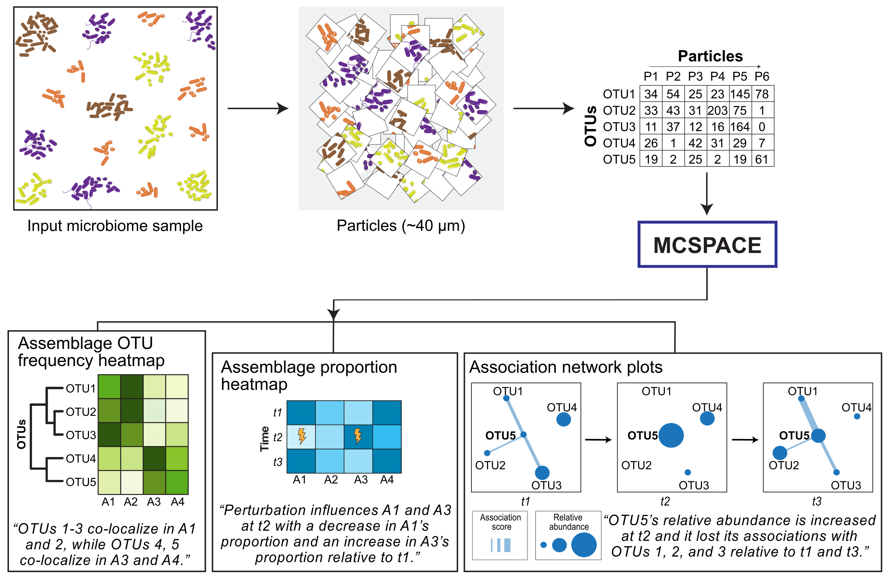

# MCSPACE

The MCSPACE software package implements a custom, generative AI-based model for identifying, from sequencing data, spatially co-localized groups of microbes, termed assemblages, and detecting changes in the proportions of these assemblages over time and due to introduced perturbations.

## Installation
### Install the MCSPACE package from pip via source:
```
git clone https://github.com/gerberlab/MCSPACE.git
pip install MCSPACE/.
```

### Install [pytorch](https://pytorch.org/) from pip

#### Linux or Windows (with NVIDIA GPU and CUDA 11.8)
```
pip3 install torch torchvision torchaudio --index-url https://download.pytorch.org/whl/cu118
```

#### Linux or Windows (CPU only)
```
pip3 install torch torchvision torchaudio --index-url https://download.pytorch.org/whl/cpu
```

#### MacOS (CUDA not supported)
```
pip3 install torch torchvision torchaudio
```

## Documentation
MCSPACE is implemented as a python library and as a command line interface (CLI). The library can be imported using the command: `import mcspace`, and the CLI is accessed using the command `mcspace`. The main classes and methods are documented [here](./mcspace/docs/README.md).


## Description of inputs and outputs

The MCSPACE model takes as input spatial co-localization sequencing data from technologies such as [MaPS-seq](https://pubmed.ncbi.nlm.nih.gov/31332325/) and [SAMPL-seq](https://pubmed.ncbi.nlm.nih.gov/39416120/) over time, as well as information on which timepoints correspond to experimental perturbations. The MCSPACE model then infers a sparse set of microbial assemblages and their proportions over time, as well as which assemblages are significantly affected by perturbations. See the [tutorials](./mcspace/tutorials/README.md) for examples on running the model pipeline.


## Tutorials
To get familiar with the model and software, we recommend going through the provided tutorials [here](./mcspace/tutorials/). These go over how to format data for MCSPACE, how to filter and preprocess data for inference, how to run model inference, and methods for visualizing the results.

## References

- Uppal, G., Urtecho, G., Richardson, M., Moody, T., Wang, H.H. and Gerber, G.K., MC-SPACE: Microbial communities from spatially associated counts engine. [ICML CompBio.](https://icml-compbio.github.io/2023/papers/WCBICML2023_paper48.pdf)
